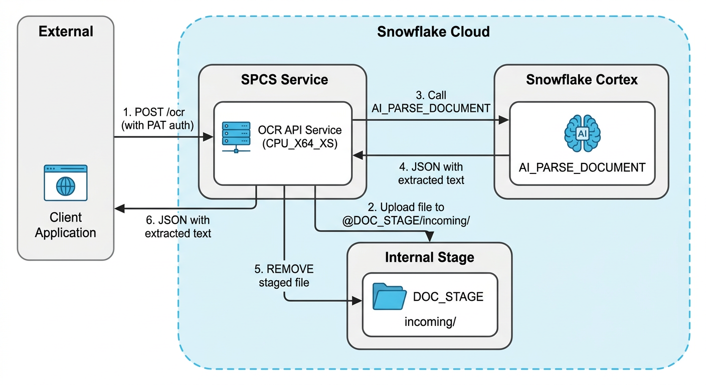

# Document OCR REST API

A REST API that extracts text from documents using Snowflake's [AI_PARSE_DOCUMENT](https://docs.snowflake.com/en/sql-reference/functions/ai_parse_document) function in OCR mode, deployed on [Snowpark Container Services](https://docs.snowflake.com/en/developer-guide/snowpark-container-services/overview) (SPCS). Upload a PDF or image, get back the extracted text.

## Architecture



## How It Works

1. Client uploads a document via `POST /ocr` as a multipart form file, authenticated with a Snowflake PAT.
2. The SPCS-hosted FastAPI app validates the file extension.
3. The app stages the file to `@DOCUMENT_OCR.PUBLIC.DOC_STAGE` via PUT.
4. The app calls `AI_PARSE_DOCUMENT` in OCR mode on the staged file.
5. The app removes the file from stage (guaranteed via `try/finally`).
6. The app returns the extracted text as `{"text": "..."}`.

The container authenticates to Snowflake automatically using the SPCS OAuth token at `/snowflake/session/token`.

## Snowflake Objects

| Object | Type | Purpose |
|--------|------|---------|
| `DOCUMENT_OCR` | Database | Houses all OCR API objects |
| `DOCUMENT_OCR.PUBLIC.DOC_STAGE` | Internal Stage | Transient file storage for OCR processing |
| `DOCUMENT_OCR.PUBLIC.OCR_REPO` | Image Repository | Stores the Docker image |
| `OCR_POOL` | Compute Pool | CPU_X64_XS (1 vCPU, 6 GB RAM) |
| `DOCUMENT_OCR.PUBLIC.OCR_SERVICE` | Service | Runs the FastAPI container |

## Deployment

### Prerequisites

- Snowflake account with SPCS enabled
- Docker installed locally
- [Snowflake CLI](https://docs.snowflake.com/en/developer-guide/snowflake-cli/index) (`snow`) installed
- `ACCOUNTADMIN` role (or equivalent privileges)

### 1. Create Snowflake infrastructure (one-time)

```sql
CREATE DATABASE IF NOT EXISTS DOCUMENT_OCR;

CREATE STAGE IF NOT EXISTS DOCUMENT_OCR.PUBLIC.DOC_STAGE
  DIRECTORY = (ENABLE = TRUE)
  ENCRYPTION = (TYPE = 'SNOWFLAKE_SSE');

CREATE IMAGE REPOSITORY IF NOT EXISTS DOCUMENT_OCR.PUBLIC.OCR_REPO;

CREATE COMPUTE POOL IF NOT EXISTS OCR_POOL
  MIN_NODES = 1
  MAX_NODES = 1
  INSTANCE_FAMILY = CPU_X64_XS;
```

### 2. Build and push the Docker image

```bash
snow spcs image-registry login --connection <your-connection>

docker build --platform linux/amd64 -t ocr-api:latest .

docker tag ocr-api:latest \
  <account>.registry.snowflakecomputing.com/document_ocr/public/ocr_repo/ocr-api:latest

docker push \
  <account>.registry.snowflakecomputing.com/document_ocr/public/ocr_repo/ocr-api:latest
```

### 3. Deploy the service

```sql
CREATE SERVICE IF NOT EXISTS DOCUMENT_OCR.PUBLIC.OCR_SERVICE
  IN COMPUTE POOL OCR_POOL
  FROM SPECIFICATION $$
  spec:
    containers:
    - name: ocr-api
      image: /document_ocr/public/ocr_repo/ocr-api:latest
      env:
        SNOWFLAKE_WAREHOUSE: COMPUTE_WH
        SNOWFLAKE_STAGE: "@DOCUMENT_OCR.PUBLIC.DOC_STAGE"
      resources:
        requests:
          memory: 512Mi
          cpu: 500m
        limits:
          memory: 2Gi
          cpu: 1000m
      readinessProbe:
        port: 8080
        path: /health
    endpoints:
    - name: ocr
      port: 8080
      public: true
  $$
  MIN_INSTANCES = 1
  MAX_INSTANCES = 1;
```

### 4. Get the endpoint URL

```sql
SHOW ENDPOINTS IN SERVICE DOCUMENT_OCR.PUBLIC.OCR_SERVICE;
```

### 5. Suspend / Resume the compute pool

```sql
-- Suspend (stops billing)
ALTER COMPUTE POOL OCR_POOL SUSPEND;

-- Resume
ALTER COMPUTE POOL OCR_POOL RESUME;
```

## Authentication

The SPCS public endpoint requires Snowflake authentication. The simplest method is a **Programmatic Access Token (PAT)**.

### Creating a PAT

```sql
ALTER USER <username> ADD PROGRAMMATIC ACCESS TOKEN ocr_api_pat;
```

Save the returned token to `~/.snowflake/tokens/`.

### Using a PAT with curl

```bash
curl -s -X POST https://<ingress_url>/ocr \
  -H "Authorization: Snowflake Token=\"$(cat ~/.snowflake/tokens/.coco_desktop_pat_demo_aws2)\"" \
  -F "file=@docs/Usage.pdf"
```

## Usage (curl examples)

### Extract text from a PDF

```bash
curl -s -X POST https://<ingress_url>/ocr \
  -H "Authorization: Snowflake Token=\"$(cat ~/.snowflake/tokens/.coco_desktop_pat_demo_aws2)\"" \
  -F "file=@docs/Usage.pdf"
```

### Extract text from an image

```bash
curl -s -X POST https://<ingress_url>/ocr \
  -H "Authorization: Snowflake Token=\"$(cat ~/.snowflake/tokens/.coco_desktop_pat_demo_aws2)\"" \
  -F "file=@scan.png"
```

### Example response

```json
{
  "text": "Invoice #12345\nDate: 2026-01-15\nTotal: $1,250.00\n..."
}
```

## Local Development

The app also runs locally for development (no PAT needed):

```bash
pip install -r requirements.txt
SNOWFLAKE_CONNECTION_NAME=AWS-DEMO-2 uvicorn app:app --host 0.0.0.0 --port 8000
```

```bash
curl -s -X POST http://localhost:8000/ocr -F "file=@docs/Usage.pdf"
```

When running inside SPCS, authentication is automatic via the OAuth token. When running locally, it uses your `~/.snowflake/connections.toml` connection.

## Supported File Types

| Extension | Type |
|-----------|------|
| `.pdf` | PDF documents |
| `.png`, `.jpg`, `.jpeg` | Images |
| `.tiff`, `.webp` | Images |
| `.docx`, `.pptx` | Office documents |
| `.html`, `.txt` | Text files |

Unsupported file types return a `400 Bad Request` error.

## API Reference

### `POST /ocr`

Upload a document and receive extracted text.

**Request:** Multipart form data with a `file` field.

**Headers:** `Authorization: Snowflake Token="<PAT>"` (required for SPCS endpoint, not needed for local dev).

**Responses:**

| Status | Description |
|--------|-------------|
| `200` | Success. Returns `{"text": "..."}` |
| `400` | Unsupported file type |
| `500` | Snowflake error or processing failure |

### `GET /health`

Health check endpoint used by SPCS readiness probe.

## Updating the Service

After code changes, rebuild and push the image, then alter the service:

```bash
docker build --platform linux/amd64 -t ocr-api:latest .
docker tag ocr-api:latest <registry>/document_ocr/public/ocr_repo/ocr-api:latest
docker push <registry>/document_ocr/public/ocr_repo/ocr-api:latest
```

```sql
ALTER SERVICE DOCUMENT_OCR.PUBLIC.OCR_SERVICE FROM SPECIFICATION $$
  <full spec yaml>
$$;
```

## Troubleshooting

```sql
-- Check service status
SELECT SYSTEM$GET_SERVICE_STATUS('DOCUMENT_OCR.PUBLIC.OCR_SERVICE');

-- View container logs
SELECT SYSTEM$GET_SERVICE_LOGS('DOCUMENT_OCR.PUBLIC.OCR_SERVICE', 0, 'ocr-api', 50);

-- Check compute pool
DESCRIBE COMPUTE POOL OCR_POOL;
```

## Constraints

| Limit | Value |
|-------|-------|
| Max file size | 50 MB |
| Max pages per document | 500 |
| AI_PARSE_DOCUMENT cost (OCR) | 0.5 credits per 1,000 pages |
| Compute pool | CPU_X64_XS (1 vCPU, 6 GB RAM) |

## Cost

- **Compute pool:** CPU_X64_XS (~0.07 credits/hr when running). Suspend when not in use to stop billing.
- **AI_PARSE_DOCUMENT:** 0.5 credits per 1,000 pages (charged per request)
- **Warehouse:** Used only during PUT/REMOVE/AI_PARSE_DOCUMENT calls

## Project Structure

```
document-ocr-rest-api/
  app.py              # FastAPI application (SPCS + local dev)
  Dockerfile          # Container image definition
  requirements.txt    # Python dependencies
  docs/               # Sample PDFs for testing
  README.md           # This file
```
